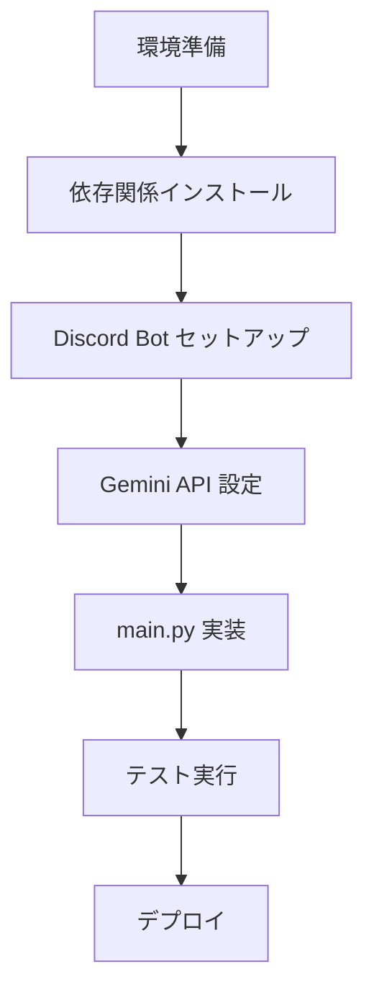

# 🛠️ Voice2Tweet Bot - 実装手順書

## 📌 ドキュメント情報
- **作成日**: 2025-11-30
- **バージョン**: 1.0 (MVP)
- **対象読者**: 実装担当者（Claude Code / AI コーディングツール）

---

## 1. 実装の全体フロー



---

## 2. 事前準備（手動作業）

### 2.1 Discord Bot の作成
1. [Discord Developer Portal](https://discord.com/developers/applications) にアクセス
2. 「New Application」をクリックし、Bot 名を入力
3. 左メニューの「Bot」セクションに移動
4. 「Add Bot」をクリック
5. **重要**: 「Privileged Gateway Intents」セクションで以下を有効化:
   - ✅ **Message Content Intent** (必須)
   - ✅ **Server Members Intent** (オプション)
   - ✅ **Presence Intent** (オプション)
6. 「Token」セクションで「Reset Token」→「Copy」してトークンを保存
7. 「OAuth2」→「URL Generator」で以下を選択:
   - Scopes: `bot`
   - Bot Permissions: `Send Messages`, `Read Message History`, `Use Slash Commands`
8. 生成された URL でサーバーに Bot を招待

### 2.2 Gemini API Key の取得
1. [Google AI Studio](https://aistudio.google.com/app/apikey) にアクセス
2. 「Create API Key」をクリック
3. API Key をコピーして保存

---

## 3. 実装詳細

### 3.1 ディレクトリ構成
```
isdf_tweet_drafter/
├── .env                  # 環境変数（Gitにコミットしない）
├── .env.example          # 環境変数テンプレート
├── .gitignore            # Git除外設定
├── requirements.txt      # Pythonパッケージ
├── main.py               # メインコード
├── README.md             # プロジェクト概要
├── REQUIREMENTS.md       # 要件定義書
├── IMPLEMENTATION_PLAN.md # 本ドキュメント
└── CLAUDE.md             # Claude Code用コンテキスト
```

---

### 3.2 環境変数設定

#### `.env` ファイル
```env
DISCORD_TOKEN=your_discord_bot_token_here
GEMINI_API_KEY=your_gemini_api_key_here
```

#### `.env.example` ファイル
```env
DISCORD_TOKEN=
GEMINI_API_KEY=
```

---

### 3.3 依存ライブラリ

#### `requirements.txt`
```txt
discord.py>=2.3.0
google-generativeai>=0.3.0
python-dotenv>=1.0.0
```

---

### 3.4 main.py の実装仕様

#### 3.4.1 インポート
```python
import os
import discord
from discord import app_commands
from discord.ui import Button, View
import google.generativeai as genai
from dotenv import load_dotenv
from urllib.parse import quote
```

#### 3.4.2 環境変数の読み込み
```python
load_dotenv()
DISCORD_TOKEN = os.getenv("DISCORD_TOKEN")
GEMINI_API_KEY = os.getenv("GEMINI_API_KEY")
```

#### 3.4.3 Gemini API 設定
```python
genai.configure(api_key=GEMINI_API_KEY)

# システムインストラクション
SYSTEM_INSTRUCTION = """
あなたはSNS投稿の編集アシスタントです。
ユーザーから入力されたテキスト（音声入力による乱雑なメモ）を、
X（旧Twitter）への投稿に適した形式にリライトしてください。

ルール:
1. 誤字脱字を修正し、自然な口語体にする。
2. 必ず140文字以内に収める。
3. ハッシュタグは付けない。
4. 絵文字を1つ〜2つ適度に使用して親しみやすくする。
5. 結果のテキストのみを出力する（説明文は不要）。
"""

model = genai.GenerativeModel(
    model_name="gemini-2.5-flash",
    system_instruction=SYSTEM_INSTRUCTION
)
```

#### 3.4.4 Discord Bot 設定
```python
intents = discord.Intents.default()
intents.message_content = True  # メッセージ内容を読み取る権限
client = discord.Client(intents=intents)
```

#### 3.4.5 メッセージ受信イベント
```python
@client.event
async def on_ready():
    print(f'✅ Logged in as {client.user}')

@client.event
async def on_message(message):
    # Bot自身のメッセージは無視
    if message.author == client.user:
        return

    # 空メッセージは無視
    if not message.content.strip():
        return

    # 処理中のリアクション
    async with message.channel.typing():
        try:
            # Gemini APIでテキスト整形
            response = model.generate_content(message.content)
            formatted_text = response.text.strip()

            # URLエンコード
            encoded_text = quote(formatted_text)
            tweet_url = f"https://twitter.com/intent/tweet?text={encoded_text}"

            # Discord Embed 作成
            embed = discord.Embed(
                title="📝 ツイート整形完了",
                color=discord.Color.blue()
            )
            embed.add_field(
                name="整形前",
                value=f"```\n{message.content[:100]}...\n```" if len(message.content) > 100 else f"```\n{message.content}\n```",
                inline=False
            )
            embed.add_field(
                name="整形後（{len(formatted_text)}文字）",
                value=formatted_text,
                inline=False
            )

            # ボタン作成
            view = View()
            button = Button(
                label="Xアプリで開く",
                style=discord.ButtonStyle.link,
                url=tweet_url,
                emoji="🐦"
            )
            view.add_item(button)

            # 返信
            await message.reply(embed=embed, view=view)

        except Exception as e:
            # エラーハンドリング
            error_embed = discord.Embed(
                title="❌ エラーが発生しました",
                description=f"```\n{str(e)}\n```",
                color=discord.Color.red()
            )
            await message.reply(embed=error_embed)
```

#### 3.4.6 Bot 起動
```python
if __name__ == "__main__":
    if not DISCORD_TOKEN or not GEMINI_API_KEY:
        print("❌ エラー: .envファイルにDISCORD_TOKENとGEMINI_API_KEYを設定してください")
        exit(1)

    client.run(DISCORD_TOKEN)
```

---

## 4. 実装チェックリスト

### 4.1 コード実装
- [ ] `requirements.txt` に必要なライブラリを記述
- [ ] `.env.example` を作成
- [ ] `.gitignore` に `.env` を追加
- [ ] `main.py` に上記仕様通りのコードを実装
- [ ] エラーハンドリングを実装
- [ ] 文字数カウント表示を実装

### 4.2 動作確認
- [ ] Bot が Discord にログインできる
- [ ] メッセージを受信して処理が開始される
- [ ] Gemini API から整形結果が返る
- [ ] Embed が正しく表示される
- [ ] ボタンクリックで Twitter Intent URL が開く
- [ ] スマホで開いた時に X アプリが起動する

### 4.3 エラーケース確認
- [ ] API エラー時にエラーメッセージが表示される
- [ ] 空メッセージを送っても無視される
- [ ] 長文でも140字以内に収まる

---

## 5. デバッグ方法

### 5.1 ログ出力
```python
# Gemini APIのレスポンスをログ出力
print(f"[DEBUG] Original: {message.content}")
print(f"[DEBUG] Formatted: {formatted_text}")
print(f"[DEBUG] Length: {len(formatted_text)}")
```

### 5.2 よくあるエラーと対処法

| エラー | 原因 | 解決方法 |
|--------|------|----------|
| `discord.errors.LoginFailure` | Token が無効 | Discord Developer Portal でトークンを再生成 |
| `Forbidden: 403` | Message Content Intent が無効 | Discord Developer Portal で Intent を有効化 |
| `google.api_core.exceptions.InvalidArgument` | API Key が無効 | Google AI Studio で API Key を確認 |
| ボタンが押せない | URL が長すぎる | テキストを短縮するようシステムインストラクション調整 |

---

## 6. テスト手順

### 6.1 ローカルテスト
1. 仮想環境を作成（推奨）:
   ```bash
   python -m venv venv
   source venv/bin/activate  # Windows: venv\Scripts\activate
   ```

2. 依存関係インストール:
   ```bash
   pip install -r requirements.txt
   ```

3. `.env` ファイルを作成し、トークンを設定

4. Bot を起動:
   ```bash
   python main.py
   ```

5. Discord でメッセージを送信してテスト

### 6.2 テストケース
1. **正常系**:
   - 短い文章（10文字）
   - 長い文章（200文字以上）
   - 誤字を含む文章
   - 音声入力風の文章（「えーと」「あのー」など）

2. **異常系**:
   - 空メッセージ
   - 特殊文字のみ
   - 絵文字のみ

---

## 7. デプロイ（オプション）

### 7.1 クラウド環境での稼働
- **Heroku**: 無料プランで 24 時間稼働
- **AWS EC2**: t2.micro で無料枠利用可能
- **Google Cloud Run**: サーバーレスで低コスト

### 7.2 常時稼働のためのTips
- `systemd` でサービス化（Linux）
- PM2 で管理（Node.js環境）
- Docker コンテナ化

---

## 8. メンテナンス

### 8.1 システムインストラクションの調整
- ユーザーのフィードバックに基づき、`SYSTEM_INSTRUCTION` を調整
- 絵文字の数、トーン、文字数制限などをカスタマイズ可能

### 8.2 ライブラリのアップデート
```bash
pip install --upgrade discord.py google-generativeai
pip freeze > requirements.txt
```

---

## 9. トラブルシューティング

### 9.1 Bot が起動しない
- `.env` ファイルが正しく読み込まれているか確認
- Python バージョンが 3.10 以上か確認

### 9.2 メッセージを受信しない
- Message Content Intent が有効か確認
- Bot がサーバーに招待されているか確認

### 9.3 Gemini API エラー
- API Key が有効か確認
- Google AI Studio でクォータ制限を確認

---

## 10. 実装完了後のチェックリスト

- [ ] すべての機能が動作する
- [ ] エラーハンドリングが適切
- [ ] コードにコメントが記載されている
- [ ] README.md が更新されている
- [ ] Git にコミットされている（`.env` は除く）
- [ ] 本番環境でテストが完了している

---

**次のステップ**:
実装完了後、`REQUIREMENTS.md` の成功基準をすべて満たしているか確認してください。
